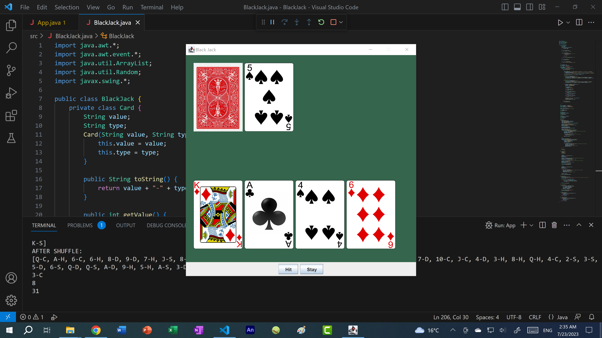

# Black Jack (Java)

Description: Blackjack Game

This Java program is a graphical implementation of the classic Blackjack card game using the Swing framework. It allows a single player to compete against a computer-controlled dealer.

Key Features:
Card and Deck Management:

Card Class: Represents a card with a value (e.g., "A", "10", "J") and a suit ("C", "D", "H", "S").
Deck: A standard deck is built, shuffled, and managed through methods that deal cards to both the player and dealer.
Game Flow:

The player and dealer each start with two cards. The player's goal is to get as close to 21 as possible without going over.
The player can "Hit" to draw another card or "Stay" to end their turn. The dealer reveals its hidden card and draws until reaching at least 17.
The game determines the winner based on who is closest to 21 without exceeding it.
GUI Implementation:

The game uses JFrame and JPanel to display cards and buttons for interaction.
The paintComponent() method handles the graphical representation of the cards and game outcome.
Summary:
This program offers a simple, interactive Blackjack game with a visual interface, card management, and basic game logic to simulate the classic casino experience.

